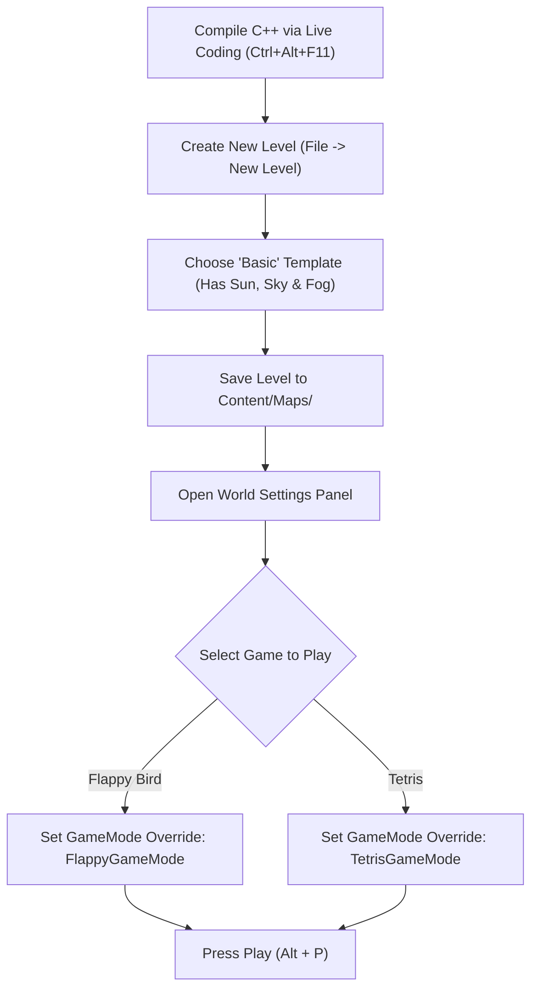

# Scene Setup & Gameplay Guide (UE 5.6)
### A Practical Guide for Senior Unity Developers

This guide walks you through setting up dedicated levels (**Scenes**) in Unreal Engine 5.6 for both **Flappy Bird** and **Tetris**, configuring environment/lighting, hooking up GameModes, and testing gameplay.

---

## 1. Unity vs Unreal: Scene Architecture at a Glance

If you are coming from Unity, here is how the core scene concepts map:

| Unity Scene Concept | Unreal Engine Equivalent | What It Does |
| :--- | :--- | :--- |
| **`Scene` (`.unity`)** | **`Level` / `Map` (`.umap`)** | Container for all actors placed in 3D space. |
| **`Assets/Scenes/`** | **`Content/Maps/`** (or `Content/`) | Conventional directory where level assets are saved. |
| **Main Camera GameObject** | **`AFlappyBirdPawn` / `ATetrisPawn` (CameraComponent)** | Pawns contain their own camera, activated automatically on possession. |
| **Scene `GameManager` Object** | **`AGameModeBase` (in World Settings)** | Dictates game rules, spawns pawns, assigns HUD, and manages game state. |
| **`Light` (Directional) + Skybox** | **Directional Light + Sky Atmosphere + Skylight** | Unreal's physically-based lighting and sky stack. |
| **Default Scene Template** | **Basic Level / Empty Level** | Pre-populated with lighting rig or completely blank. |

---

## 2. Complete Setup Pipeline

---

## 3. Step 0: Compile the C++ Code

Before setting up levels, ensure the C++ classes are compiled into the running editor:

1. In the **Unreal Editor**, press **`Ctrl + Alt + F11`** (or click the **Live Coding** button at the bottom-right corner of the editor status bar).
2. Wait for the notification sound and the message: **`Live coding succeeded`**.
3. *Why?* Unlike Unity where C# recompiles in the background on file save, Unreal uses C++ Live Coding (hot reload) to patch the running engine binaries without restarting the editor.

---

## 4. Setting Up the Flappy Bird Level

### Step 1: Create the Level
1. In the top menu bar, click **File $\rightarrow$ New Level...** (or press `Ctrl + N`).
2. In the popup dialog, choose the **Basic** template.
   > [!NOTE]
   > The **Basic** template includes a Directional Light, Sky Light, Sky Atmosphere, Volumetric Cloud, and Exponential Height Fog out-of-the-box.
3. Click **Create**.

### Step 2: Clean the Floor (Optional but Recommended)
1. In the **Outliner** panel (top-right, equivalent to Unity's *Hierarchy*):
   - Select the default **Floor** actor.
   - Delete it or set its $Z$ location to `-800` so it doesn't intersect with the Flappy Bird playfield.
   - *(Note: `AFlappyGameMode` procedurally spawns its own grass floor at $Z = -390$ and sky backdrop at $X = 120$!)*

### Step 3: Configure World Settings (GameMode Override)
1. Open the **World Settings** tab:
   - If not already visible next to the Outliner/Details panel, enable it from the top menu: **Window $\rightarrow$ World Settings**.
2. Locate the **GameMode** category at the top of the World Settings panel.
3. Expand **GameMode Override** and select:
   $$\mathbf{FlappyGameMode}$$
4. Notice that when you select `FlappyGameMode`, Unreal automatically populates:
   - **Default Pawn Class**: `FlappyBirdPawn`
   - **HUD Class**: `FlappyHUD`
   - **Player Controller Class**: `PlayerController`

### Step 4: Ensure Player Start is at Origin
1. Check the Outliner for the **PlayerStart** actor.
2. In the **Details** panel (equivalent to Unity's *Inspector*), set its **Location**:
   - $X = 0.0$
   - $Y = 0.0$
   - $Z = 0.0$
   *(If no `PlayerStart` exists, search for `Player Start` in the **Place Actors** panel and drag it into the level at $(0, 0, 0)$).*

### Step 5: Save the Level
1. Press `Ctrl + S`.
2. Navigate to your `Content` directory (create a `Maps` folder if desired: `Content/Maps/`).
3. Name the level: **`Lvl_FlappyBird`**.
4. Click **Save**.

---

## 5. Playing Flappy Bird

1. Click the green **Play** button on the main toolbar, or press **`Alt + P`**.
2. The game opens in the **Ready** state showing the title banner:
   - Press **`SpaceBar`**, **`Left Mouse Button`**, **`Up Arrow`**, or **`W`** to flap and begin playing!
3. Pipes will spawn from the right side ($+Y$) and scroll left ($-Y$).
4. Passing through the gap between pipes increments your score by $+1$.
5. Hitting a pipe or falling onto the floor triggers **Game Over**.
6. Press **`SpaceBar`** or **`R`** to restart instantly.

---

## 6. Setting Up the Tetris Level

### Step 1: Create a Clean Level
1. Click **File $\rightarrow$ New Level...** (`Ctrl + N`).
2. Choose **Basic** (or **Empty Level** with a Directional Light).
3. In the Outliner, select the default **Floor** and delete it or move it down to $Z = -500$.

### Step 2: Configure World Settings
1. Open the **World Settings** panel (**Window $\rightarrow$ World Settings**).
2. Set **GameMode Override** to:
   $$\mathbf{TetrisGameMode}$$
3. Unreal automatically links:
   - **Default Pawn Class**: `TetrisPawn` (centered orthographic camera facing the board)
   - **HUD Class**: `TetrisHUD` (Score, Level, Lines, Next Piece preview, and key legend)

### Step 3: Player Start Position
1. In the Outliner, set the **PlayerStart** location to:
   - $X = -850.0$
   - $Y = 0.0$
   - $Z = 380.0$
   *(Note: Even if `PlayerStart` is at origin, `ATetrisPawn` automatically positions its camera at $X = -850, Y = 0, Z = 380$ to frame the $10 \times 20$ board perfectly!)*

### Step 4: Save the Level
1. Press `Ctrl + S`.
2. Save as: **`Lvl_Tetris`** in `Content/Maps/`.

---

## 7. Playing Tetris

1. Press **`Alt + P`** to Play.
2. The board immediately spawns with a dark cabinet backplane, colored tetrominoes, and a Next Piece preview on the right.
3. **Controls**:
   - **`A` / `Left Arrow`**: Move piece left.
   - **`D` / `Right Arrow`**: Move piece right.
   - **`W` / `Up Arrow`**: Rotate piece clockwise (with automatic wall-kick handling).
   - **`S` / `Down Arrow`**: Soft drop (falls faster, $+1$ point per cell).
   - **`SpaceBar` / `Enter`**: Hard drop (instant drop & lock, $+2$ points per cell).
   - **`R`**: Restart game.
4. Completing full horizontal rows clears them:
   - $1\text{ line} = 100 \times \text{Level}$
   - $2\text{ lines} = 300 \times \text{Level}$
   - $3\text{ lines} = 500 \times \text{Level}$
   - $4\text{ lines (TETRIS!)} = 800 \times \text{Level}$
5. Every 10 cleared lines increases the **Level** and accelerates gravity drop speed.

---

## 8. Quick Level Switcher: Playing from the Default Map

If you prefer not to switch levels and want to test immediately in `Content/TopDown/Lvl_TopDown`:

1. Open `Content/TopDown/Lvl_TopDown.umap`.
2. Open **World Settings**.
3. Under **GameMode Override**, switch between:
   - `FlappyGameMode` $\rightarrow$ Flappy Bird
   - `TetrisGameMode` $\rightarrow$ Tetris
   - `LearnUnreal_56_1GameMode` $\rightarrow$ Default Top Down template
4. Hit **`Alt + P`**!

---

## 9. Tweaking Gameplay Parameters in the Editor

Because our C++ properties are marked with `UPROPERTY(EditAnywhere, BlueprintReadWrite)`, you can customize their balance directly from the Unreal Editor without writing code!

### Creating a Custom GameMode Blueprint Subclass (Unity Prefab equivalent):
1. In the **Content Browser**, right-click $\rightarrow$ **Blueprint Class**.
2. Expand **All Classes**, search for `FlappyGameMode` (or `TetrisBoardActor`), and click **Select**.
3. Name it `BP_FlappyGameMode`.
4. Open it to find the exposed parameters in the **Details** panel:
   - **Flappy Config**:
     - `PipeSpawnInterval` (default: $1.9\text{ s}$)
     - `GapSize` (default: $250\text{ cm}$)
     - `PipeSpeed` (default: $340\text{ cm/s}$)
     - `MinGapZ` / `MaxGapZ` (vertical variance)
   - **Bird Physics** (on `BP_FlappyBirdPawn`):
     - `FlapStrength` (default: $550\text{ cm/s}$)
     - `Gravity` (default: $-1500\text{ cm/s}^2$)
   - **Tetris Config** (on `BP_TetrisBoardActor`):
     - `BaseDropInterval` (default: $0.75\text{ s}$)

---

## 10. Senior Unity Dev Pro-Tips & Common Pitfalls

> [!TIP]
> **Viewports & Input Capture**:
> In Unreal PIE (Play in Editor), click once inside the viewport to capture mouse/keyboard focus. If you need to release the mouse cursor back to the editor, press **`Shift + F1`**.

> [!NOTE]
> **Play Modes**:
> Click the three dots `...` next to the Play button on the toolbar:
> - **Selected Viewport**: Plays directly in the active editor pane.
> - **New Editor Window (PIE)**: Launches an isolated floating window with accurate aspect ratio.
> - **Standalone Game**: Runs as a separate process (closest to a shipping build).

> [!CAUTION]
> **Live Coding vs Hot Reload**:
> Always compile via **`Ctrl + Alt + F11`** while the editor is running. Do NOT build from Visual Studio with the editor open unless Live Coding is disabled, as Windows file locks on `.dll` files will trigger compile error `Unable to build while Live Coding is active`.
