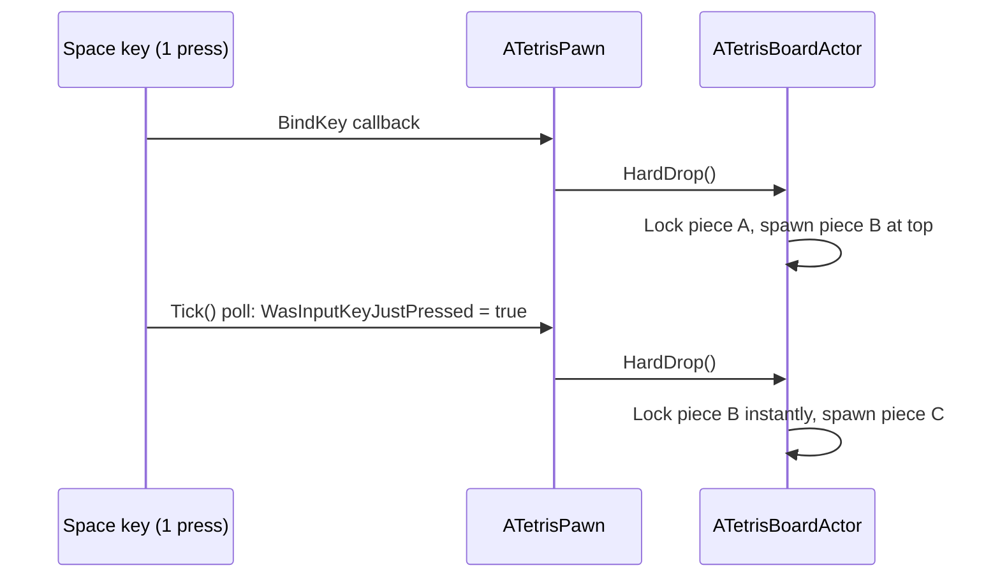
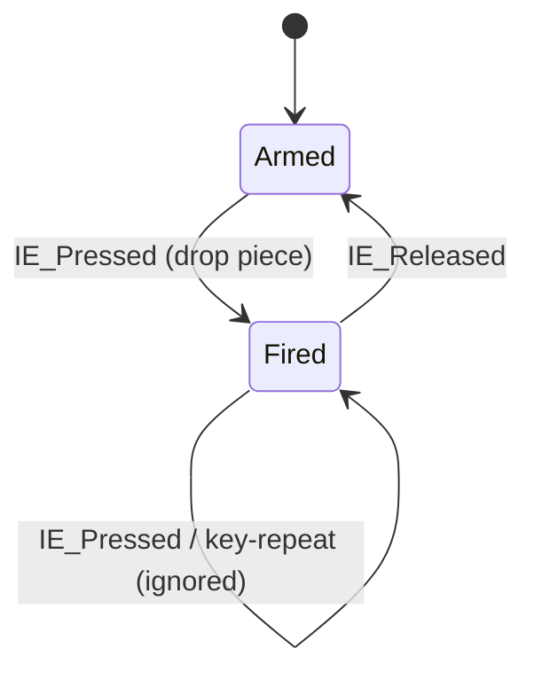

# Tetris Hard Drop Fix — "Two Pieces Dropped on One Space Press"

A post-mortem of the Tetris hard-drop bug, why the first fixes seemed not to work, and the final solution.
Written for a Unity developer learning Unreal Engine 5.6.

---

## 1. Symptom

- Pressing **Space** once dropped **two** pieces.
- The second piece landed immediately, and a third piece spawned at the top.
- Score jumped by **+64** instead of **+32**.

> **Score math:** a piece spawns at row 18 and falls 16 rows to the floor.
> Hard drop gives 2 pts/row → `16 × 2 = 32`. Seeing `64` means `HardDrop()` ran **twice**.

---

## 2. Root Cause #1 — Two Input Paths for the Same Key

`ATetrisPawn` handled Space in **two places**:

```cpp
// (a) Event binding in SetupPlayerInputComponent
PlayerInputComponent->BindKey(EKeys::SpaceBar, IE_Pressed, this, &ATetrisPawn::HardDrop);

// (b) Polling in Tick  <-- the problem
if (PC->WasInputKeyJustPressed(EKeys::SpaceBar)) { HardDrop(); }
```

Both fired in the **same frame**:



**Unity analogy:** handling the same key from an `InputAction.performed` callback **and** from
`Input.GetKeyDown()` in `Update()`. Both run, so the action happens twice.

---

## 3. Root Cause #2 — Fixes Weren't Actually Running (Stale Binary)

Even after fixing the code, the bug was **still showing up in the editor**. Why?

| Clue | Meaning |
|---|---|
| HUD bottom bar had no `[T] Auto Test` | New HUD code had not loaded |
| Score was still `64` after one drop | Old double-drop code was still running |

The new code **never compiled**, for two reasons:

1. **UBT log file lock** — `C:\Users\<you>\AppData\Local\UnrealBuildTool\Log.txt` was locked by another process.
   UBT crashed with `IOException` while rotating the log, before it compiled anything.
   *Fix:* delete `Log.txt` and recompile.

2. **UE 5.5+ API change in the automation test**:
   ```
   error C2838: 'ApplicationContextMask': illegal qualified name in member declaration
   ```
   `ApplicationContextMask` is no longer inside the `EAutomationTestFlags` enum. It is now a separate constant:
   ```cpp
   // UE <= 5.4
   EAutomationTestFlags::ApplicationContextMask | EAutomationTestFlags::ProductFilter
   // UE 5.5+
   EAutomationTestFlags_ApplicationContextMask | EAutomationTestFlags::ProductFilter
   ```

> [!IMPORTANT]
> **Lesson:** when Live Coding fails, the editor **keeps running the last good DLL**. Gameplay looks normal,
> but none of your changes are in it. Always check that the Live Coding window says **"Succeeded"**
> before testing. A visible change, like new HUD text, is a quick way to confirm the new build loaded.

---

## 4. The Fix — Three Layers of Protection

All of this is in [`TetrisPawn.cpp`](../Source/LearnUnreal_56_1/Tetris/TetrisPawn.cpp).

### Layer 1 — One input source only
The `Tick()` polling was removed. Only `BindKey` drives input now. `Tick()` has a comment warning not to add polling back.

### Layer 2 — Time debounce (0.2 s)
```cpp
const double CurrentTime = FPlatformTime::Seconds();
if (CurrentTime - LastHardDropTime < 0.2) return;
LastHardDropTime = CurrentTime;
```
Catches duplicate events that arrive close together, like Space and Enter pressed at once, or a binding added twice by mistake.

### Layer 3 — Key release-gate
```cpp
PlayerInputComponent->BindKey(EKeys::SpaceBar, IE_Pressed,  this, &ATetrisPawn::OnHardDropPressed);
PlayerInputComponent->BindKey(EKeys::SpaceBar, IE_Released, this, &ATetrisPawn::OnHardDropReleased);

void ATetrisPawn::OnHardDropPressed()
{
    if (!bCanHardDrop) return;   // still held -> ignore
    bCanHardDrop = false;        // close the gate
    ...
    Board->HardDrop();
}

void ATetrisPawn::OnHardDropReleased()
{
    bCanHardDrop = true;         // re-arm on physical release
}
```
One physical press gives exactly one drop. Holding Space or OS key-repeat can't trigger more drops.



---

## 5. Diagnostics Added

| Tool | Where | What it proves |
|---|---|---|
| **`DROPS` counter on HUD** | `ATetrisHUD::DrawHUD`, `ATetrisBoardActor::GetDropCount()` | Goes up by exactly **1** per Space press |
| **`[T]` in-game test** | `ATetrisBoardActor::RunAutomatedTest()` | Scripted L-piece + S-piece drops → expects 4/196, then 8/192 occupied/free slots |
| **Unreal Automation Test** | `TetrisAutomationTest.cpp` → `LearnUnreal.Tetris.DropSimulation` | Same check, run from *Tools → Session Frontend → Automation* |
| **Standalone C++ sim** | `Docs/test_tetris_simulation.cpp` | Grid logic checked outside the engine |

---

## 6. How to Verify

1. In the editor, press `Ctrl + Alt + F11` and confirm the result is **"Succeeded"**.
2. Press Play. Check that `DROPS` and `[T] Auto Test` show on the HUD.
3. Press **Space** once → `DROPS = 1`, score `+32`, **one** piece on the floor.
4. Hold **Space** → still only one drop.
5. Press **T** → on-screen `Tetris Test: PASSED (Slots: 8/200 occupied, 192/200 free)`.

---

## 7. Files Touched

- [`TetrisPawn.h`](../Source/LearnUnreal_56_1/Tetris/TetrisPawn.h) — `LastHardDropTime`, `bCanHardDrop`, `OnHardDropPressed/Released`
- [`TetrisPawn.cpp`](../Source/LearnUnreal_56_1/Tetris/TetrisPawn.cpp) — removed Tick polling, added debounce and release-gate
- [`TetrisBoardActor.h/.cpp`](../Source/LearnUnreal_56_1/Tetris/TetrisBoardActor.cpp) — `DropCount`, `DropTimer` reset, test helpers
- [`TetrisHUD.cpp`](../Source/LearnUnreal_56_1/Tetris/TetrisHUD.cpp) — `DROPS` display
- [`TetrisAutomationTest.cpp`](../Source/LearnUnreal_56_1/Tetris/TetrisAutomationTest.cpp) — UE 5.6 flag name fix
